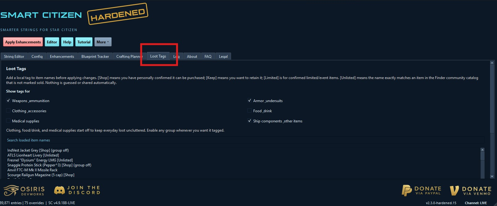
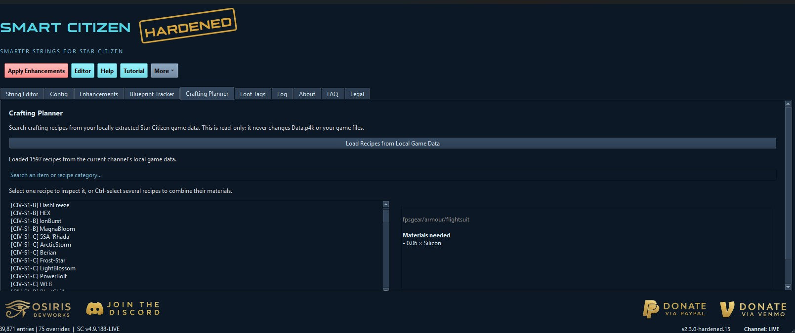
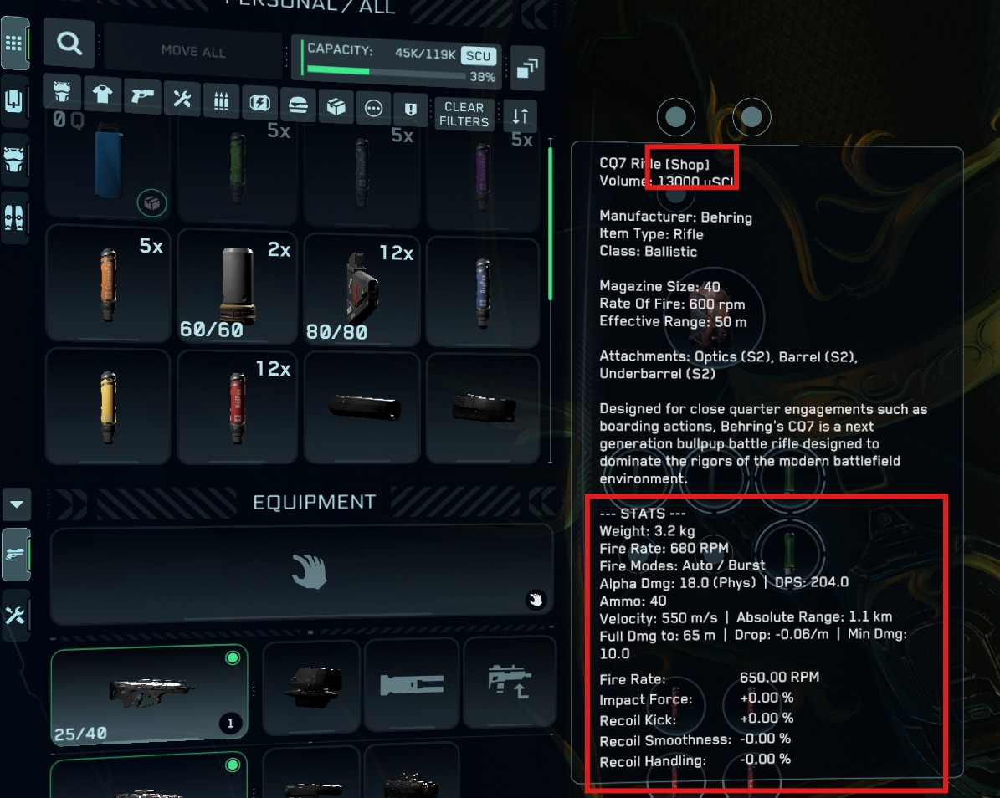
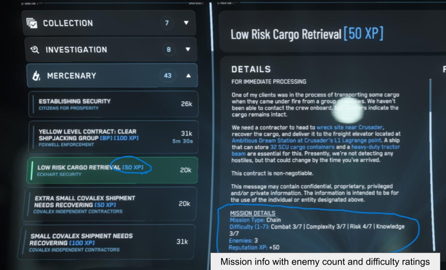

# Smart Citizen Hardened

> A portable, security-focused Star Citizen localization enhancer.

Smart Citizen Hardened adds clearer mission, blueprint, item, ship, and
crafting information to Star Citizen through local localization files. It is
not an injector, game launcher, or background service.

**[Download the latest Hardened release](../../releases/latest)**

## Major Highlights

- **Portable** — extract the release ZIP to a folder you control and run it.
  There is no installer and no background service.
- **Hardened by design** — no startup synchronization, telemetry, Discord
  reporting, or silent catalog download. The application update flow accepts
  only a signed release manifest and verified ZIP.
- **Local game-data workflow** — reads English localization and crafting data
  from your installed `Data.p4k`; it does not rely on a community data mirror.
- **Blueprint intelligence** — adds mission reward details, tracks owned
  blueprints from local logs, and handles potential and multiple reward pools.
- **Crafting Planner** — search locally extracted recipes, inspect materials,
  and combine several recipes into one shopping list.
- **Loot Tags** — optional `[Shop]`, `[Unlisted]`, `[Keep]`, and `[Limited]`
  labels help evaluate items while looting. Availability is based on exact
  matches or your own review; it is never guessed.
- **Recovery built in** — preview changes, automatically back up game files
  before Apply, restore a backup, or use Emergency Remove From Game.

## Start Here

1. Download `SmartCitizen-Hardened-v...zip` from **Releases**.
2. Extract it to a folder you control, for example `Documents\SmartCitizen`.
3. Run `SmartCitizen-Hardened.exe`.
4. Use **Quick Setup** in the upper-right corner:
   1. **Confirm Directory** — choose the folder that *contains* `LIVE`,
      `PTU`, or another Star Citizen channel. Do **not** choose the `LIVE`
      folder itself.
   2. **Import Data.p4k** — reads the local English base strings and game data
      from the selected installation. The first scan can take a few minutes.
   3. **Apply Enhancements** — imports locally recorded blueprint ownership
      when available, generates selected enhancements, makes a backup, and
      applies the result to the selected channel.

The steps unlock in order. Advanced tabs remain available for configuration,
preview, rollback, and custom edits.

**Important Note - windows defender may try and block the app from running. If it does, in the popup click more info, then click Run Anyways** (same as the main branch, this is due to smaller developer teams not having Microsoft reputation). Hash is provided for safety and verification.

Only continue after downloading from this repository's **Releases** page and
checking the published SHA-256 file against the ZIP you downloaded.

## What Changes in Star Citizen

This is a localization mod. It writes localization-related files only for the
selected Star Citizen channel after creating a rollback snapshot. It does not
inject code into the game, alter the game executable, or run while the game is
playing.

Useful additions include mission blueprint/reputation details, owned-blueprint
markers, ship and component information, crafting references, and optional
item-acquisition labels.

## Featured Tools

### Blueprint Tracker

The Blueprint Tracker collects possible mission rewards and can scan local
Star Citizen logs for earned blueprints. It supports a renamed blueprint
heading, multiple blueprint pools, and component/ship-weapon tags without
creating duplicate tracker entries.

### Crafting Planner

After local data is imported, open **Crafting Planner** in Advanced mode and
load recipes from local game data. Search an item to view its required
materials; Ctrl-select multiple recipes to combine them into one list. This
feature is read-only and never changes `Data.p4k`.

### Loot Tags

After local game data loads, open **Loot Tags** in Advanced mode. You can mark
specific names as `[Shop]`, `[Keep]`, or `[Limited]`, then Apply Enhancements
to make those labels appear in-game. `[Unlisted]` means the name exactly
matches an item that a reviewed Finder catalog marks as not sold; it does not
mean the item is guaranteed rare or loot-only.

Weapons, armor, and other gear are enabled by default. Clothing/accessories,
food/drink, and medical supplies start disabled to reduce clutter. The list is
kept locally. **Refresh Finder Shop Data** is optional and confirmed before it
makes its one HTTPS request; it preserves manual tags and visibly reports the
number of imported exact-name records.

Use **Export Catalog** and **Import Catalog** to move a catalog you trust
between computers. Nothing is shared automatically.

## Security Model

- No automatic application updates, installer execution, startup remote sync,
  telemetry, or Discord test-report submission.
- Local-only INI imports with size and content validation.
- Settings archive validation: bounded archive/expanded sizes, duplicate-entry,
  unsafe-path, and suspicious compression checks.
- Hash verification for bundled P4K extraction tools and their DLLs.
- Package-integrity check for portable releases.
- Pre-extraction free-space and temporary-cache safety checks.
- SHA-256 checked rollback snapshots before original game files are restored.
- Optional Offline Security Mode blocks and logs application network access.
- Finder catalog refresh is the only Loot Tags network action; it is explicit,
  confirmed, redirect-restricted, bounded, and validated.

See [SECURITY_HARDENING.md](SECURITY_HARDENING.md) for the detailed policy and
[CHANGELOG.md](CHANGELOG.md) for versioned changes.

## Updates and Recovery

Use the in-app update check only when you choose to look for a newer release.
It verifies the signed release manifest, ZIP hash, and packaged files before
allowing an update. A stable executable name keeps an existing shortcut valid
after an in-place update.

Before applying changes, the app creates a rollback snapshot. In Advanced
mode, use **Restore** to restore a previous backup or **More → Emergency
Remove From Game** to remove the mod's applied localization changes.

## Supported Channels and Languages

Settings, local cache, and backups are isolated by channel: LIVE, PTU, EPTU,
HOTFIX, and TECH-PREVIEW. The standard hardened workflow is English and works
without network access after download. Additional language overlays are
optional and have their own restricted download checks.

## Screenshots

<table>
  <tr>
    <td width="50%"><br/><em>Loot Tags and shop identification</em></td>
    <td width="50%"><br/><em>Crafting Planner from local game data</em></td>
  </tr>
  <tr>
    <td width="50%"><br/><em>In-game item tags</em></td>
    <td width="50%"><br/><em>Mission reward details</em></td>
  </tr>
</table>

## Project Status and Attribution

Smart Citizen Hardened is an independent community fork of
[Osiris DevWorks' Smart Citizen](https://github.com/Osiris-DevWorks/smart-citizen).
It retains and extends upstream functionality while making different choices
about portability, security, deployment, and local data handling.

Original authorship, contributors, and third-party notices remain credited in
the repository history and source. This project remains distributed under the
[Apache License 2.0](LICENSE). It is not an official Osiris DevWorks release
and is not affiliated with Cloud Imperium Games.

## Development

For developer setup and project conventions, see
[CONTRIBUTOR_GUIDE.md](docs/CONTRIBUTOR_GUIDE.md). For a disposable local
portable test build:

```powershell
.\.venv\Scripts\python.exe .\scripts\build\build_exe.py --portable --local-test
```

For a public release, build the portable package and follow the signed-release
workflow in `scripts\release\prepare_signed_release.ps1`.
