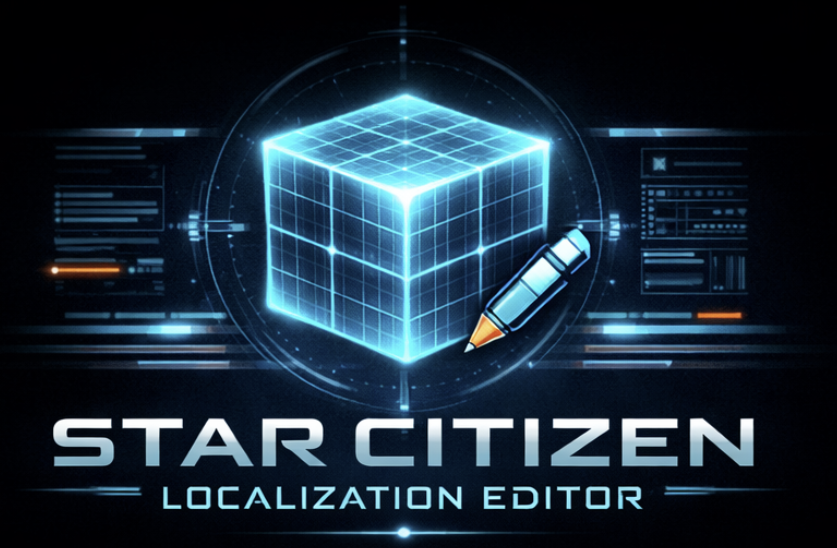

# SC Localization Editor

A PyQt6 GUI application for managing Star Citizen localization string customizations.




> [!NOTE]
> This project is forked from [ExoAE's ScCompLangPack](https://github.com/ExoAE/ScCompLangPack) and built upon the merge concepts from [MrKraken's ASOP terminal enhancements](https://www.youtube.com/@MrKraken). Rather than another fork, we've created an intuitive desktop GUI to make localization customization more user-friendly.

## ✨ Features

- **Auto-Update**: Automatically checks GitHub for the latest base localization file from the community language pack
- **Load & Edit**: Load base global.ini, then easily customize strings in an intuitive table view
- **Persistent Edits**: Your customizations are automatically saved and loaded in future sessions
- **Seamless Migration**: When Star Citizen updates, your edits are automatically re-applied to the new base file
- **Search & Filter**: Filter by search text, category, or modification status
- **Apply to Game**: Writes merged localization file (base + your edits) directly to your installation
- **Backup & Restore**: Automatic timestamped backups of game files with easy one-click restore
- **Settings Persistence**: All paths and preferences saved in Windows Registry

## 🚀 Quick Start

### Prerequisites
- Python 3.9+
- Star Citizen global.ini and vehicles.ini files (extracted from Data.p4k)

### Installation

1. **Clone the repository**
   ```bash
   git clone https://github.com/OsirisDevworks/sc-localization-editor.git
   cd sc-localization-editor
   ```

2. **Install dependencies**
   ```bash
   pip install -r requirements.txt
   ```

3. **Run the application**
   ```bash
   python src/main.py
   ```

## 📖 Usage

### First Run
1. **Auto-Update** (if outdated): On startup, the app checks for the latest base file. If available, it prompts you to download (~2.2 MB zip). Click **Yes** to update.

### Standard Workflow
1. **Load File**: Click **"Load Base File"** and select your base `global.ini`
   - The app searches your Star Citizen installation first for convenience
   - Or select any other base file (language pack, older version, etc.)

2. **Find & Customize**:
   - Use the **Search** box to find strings (search key or value)
   - Use **Category** filter (Ships, Ship Components, Other)
   - Double-click the **Custom Value** column to edit

3. **Apply Changes**: Click **"Apply to Game"**
   - Your customizations are automatically saved to `overrides.ini`
   - The game file is updated with all your edits merged in
   - A timestamped backup is created automatically

4. **Restore (if needed)**: Click **"Restore Backup"** to revert to a previous version
   - Keep up to 5 backups; oldest auto-deleted when limit reached

### After Star Citizen Updates
The game update doesn't touch your loose `global.ini` file, so it becomes stale. Simply:
1. Obtain the new base file (the app can auto-download from GitHub)
2. Click **"Load Base File"** and select the new version
3. Your saved customizations automatically re-apply (you'll see them as "Modified" in green)
4. Click **"Apply to Game"** → done! Your game now has all new keys + your custom edits

## 🛠️ Configuration

All settings are stored in Windows Registry under:
- **Organization**: Osiris DevWorks
- **Application**: SC Localization Editor

The Config tab lets you set:
- **Base global.ini path**: For the file to load and edit
- **Star Citizen install path**: Where to apply your customizations

The app automatically detects your Star Citizen installation on first run (via installer registry key).

### Data Storage
- **Your edits**: `%APPDATA%\Osiris DevWorks\SC Localization Editor\overrides.ini`
- **Base file version**: `data/base_version.txt` (for auto-update tracking)
- **Game backups**: `StarCitizen\LIVE\data\Localization\english\global.ini.bak_*` (timestamped)

## 📦 Building & Release

### Development Build
```bash
python src/main.py
```

### Create Executable
```bash
cd scripts/build
python build_exe.py
```
This creates `dist/SCLocalizationEditor-v0.2.0.exe` using PyInstaller.

### Create Installer (Windows)
Requires [Inno Setup](https://jrsoftware.org/isdl.php):
```bash
cd scripts/build
build_all.bat
```

The build script:
1. Cleans old builds
2. Builds the executable with PyInstaller
3. Compiles the installer with Inno Setup (if installed)

Outputs:
- `dist/SCLocalizationEditor-v0.2.0.exe` - Standalone executable
- `dist/SCLocalizationEditor-v0.2.0-Setup.exe` - Installer

The installer:
- Installs to `%APPDATA%\Osiris DevWorks\SC Localization Editor`
- Creates Start Menu shortcuts
- Stores Star Citizen install path in registry for auto-detection

## 📁 Project Structure

```
src/
├── main.py                 # Application entry point
├── gui/
│   ├── main_window.py      # Main UI window with threading
│   └── config_tab.py       # Settings panel
├── models/
│   └── string_model.py     # StringEntry dataclass
├── parser/
│   └── ini_parser.py       # INI file parsing
├── merger/
│   └── ini_merger.py       # Structure-preserving merge logic
└── utils/
    ├── settings.py         # Windows Registry settings management
    ├── version.py          # Version reader from VERSION.TXT
    ├── updater.py          # GitHub API check + download/extract
    └── overrides_manager.py # Overrides persistence & bootstrap
```

## 🎮 Installation Path Structure

After applying localization, your Star Citizen directory should look like:
```
StarCitizen/
└── LIVE/
    ├── user.cfg
    └── data/
        └── Localization/
            └── english/
                └── global.ini
```

## ⚖️ Legal

> [!IMPORTANT]
> **Made by the Community** - This is an unofficial Star Citizen fan project, not affiliated with the Cloud Imperium group of companies. All content in this repository not authored by its host or users are property of their respective owners.

- The ability to customize your localization using extracted global.ini files is **authorized by CIG** to support community translations until officially integrated
  - *[Star Citizen: Community Localization Update](https://robertsspaceindustries.com/spectrum/community/SC/forum/1/thread/star-citizen-community-localization-update) 2023-10-11*
- Use at your own discretion as a third-party contribution
- [RSI Terms of Service](https://robertsspaceindustries.com/en/tos)
- [Translation & Fan Localization Statement](https://support.robertsspaceindustries.com/hc/en-us/articles/360006895793-Star-Citizen-Fankit-and-Fandom-FAQ#h_01JNKSPM7MRSB1WNBW6FGD2H98)

## 🙏 Acknowledgments

- [ExoAE](https://github.com/ExoAE/ScCompLangPack) - Original ScCompLangPack concept and merge logic
- [MrKraken](https://www.youtube.com/@MrKraken) - ASOP terminal enhancements and workflow improvements
- Star Citizen Community - Localization support and testing

## 📝 License

This project is provided as-is for community use. See LICENSE file for details.

## 🤝 Support & Community

### Getting Help

For issues, feature requests, or contributions:
- **Join the Discord community** (link below) - Ask questions and get support
- **Report bugs** with steps to reproduce on the GitHub issues page
- **Request features** and suggest improvements
- **Share your custom localization sets** with the community

### Support the Project

SC Localization Editor is a free, open-source project created to help Star Citizen players customize their game localization. If you find it useful and would like to support the development:

**Donate:**
- 💳 **[PayPal Donation](https://paypal.me/RighteousKill)** - Support via PayPal
- 💰 **[Venmo Donation](https://venmo.com/u/Amr-Abouelleil)** - Support via Venmo

**Contribute:**
- Report bugs with steps to reproduce
- Request features you'd like to see
- Share configurations and localization sets with the community
- Submit code contributions via GitHub

**Join the Community:**
- 💬 **[Discord Community](https://discord.gg/BNzRegKZ7k)** - Support, discussions, and feature requests

Even if you can't donate, your feedback and bug reports are invaluable!

---

**Fly safe, Citizen!** o7
